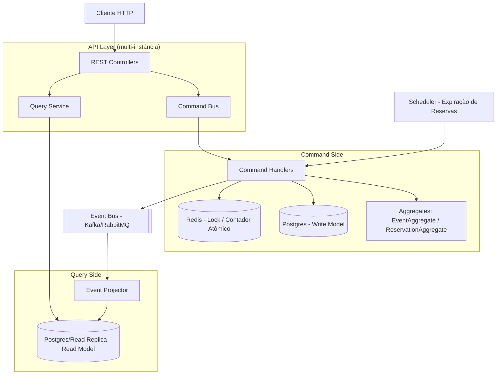
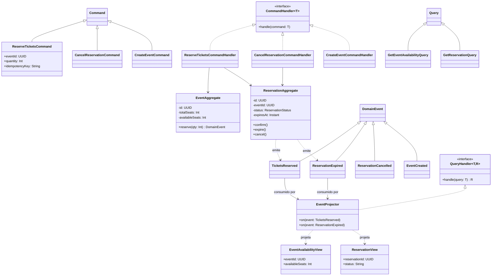
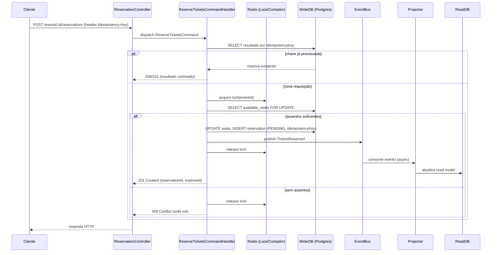
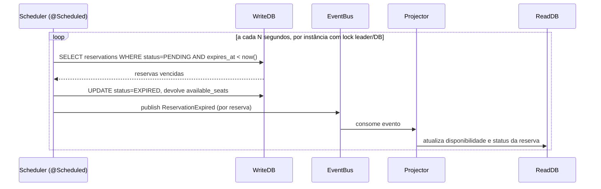
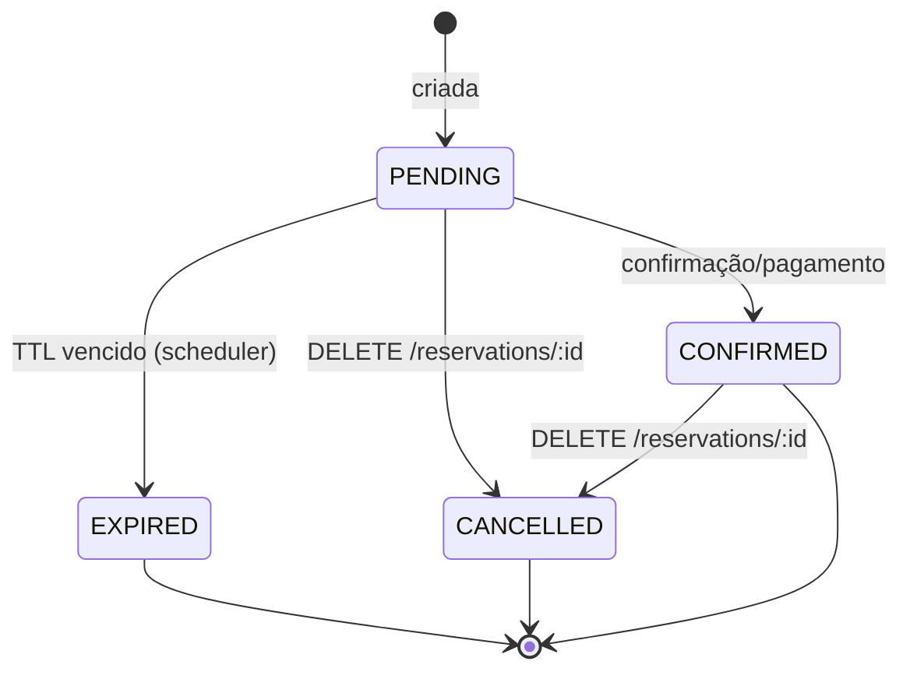

# Arquitetura Proposta — Flash Booking (CQRS + Kotlin + Spring Boot)

Documento de abordagem arquitetural para o desafio de reserva de ingressos, cobrindo os requisitos de
não-oversell, expiração automática, idempotência e consistência eventual, usando **CQRS** com **Kotlin**
e **Spring Boot**.

---

## 1. Visão Geral

- **Command side**: recebe escritas (criar evento, reservar, cancelar), valida invariantes de negócio e
  garante consistência forte (sem oversell) via transação/lock no banco de escrita.
- **Query side**: modelo de leitura desnormalizado, otimizado para `GET /events/:id` e `GET /reservations/:id`,
  atualizado de forma assíncrona a partir dos eventos de domínio (consistência eventual, conforme exigido).
- **Event Bus** (Kafka ou RabbitMQ): desacopla os dois lados e permite múltiplas instâncias da API sem
  estado compartilhado em memória.
- **Redis**: lock distribuído / contador atômico para reforçar não-oversell entre múltiplas instâncias.
- **Scheduler**: job periódico que expira reservas `PENDING` vencidas e devolve os assentos.

## 2. Diagrama de Componentes



## 3. Diagrama de Classes (CQRS)



## 4. Sequência — Reservar Ingressos (idempotência + anti-oversell)



## 5. Sequência — Expiração Automática de Reservas



## 6. Diagrama de Estados — Reserva



## 7. Decisões Arquiteturais e Trade-offs

| Decisão | Justificativa | Trade-off |
|---|---|---|
| CQRS com bases separadas (write/read) | Isola a lógica de escrita crítica (anti-oversell) da leitura de alta concorrência | Complexidade adicional de sincronização e eventual delay na leitura |
| Lock/contador atômico no Redis + `SELECT FOR UPDATE` no Postgres | Garante decremento atômico de assentos mesmo com múltiplas instâncias | Ponto de contenção sob alta concorrência; requer TTL no lock para evitar deadlock |
| Idempotency-Key persistida na tabela de comandos/reservas | Evita reservas duplicadas em retries de rede | Exige limpeza/expiração da tabela de chaves |
| Event Bus (Kafka/RabbitMQ) para propagar eventos ao read model | Desacopla escrita e leitura, permite escalar independentemente | Consistência eventual — leitura pode ficar momentaneamente desatualizada |
| Scheduler para expiração (`@Scheduled` + lock distribuído, ex. ShedLock) | Libera assentos automaticamente sem intervenção do cliente | Necessita coordenação entre instâncias para não expirar em duplicidade |

## 8. Evoluções Futuras

- Migrar o command side para **Event Sourcing** completo (persistir eventos, não apenas estado).
- Usar **outbox pattern** para publicar eventos de forma transacional junto ao commit no write DB.
- Circuit breaker/retry (Resilience4j) na publicação de eventos.
- Escalar o read model com cache (Redis) para consultas de disponibilidade de altíssimo tráfego.

## 9. Estrutura de Pacotes (Kotlin/Spring Boot)

```
src/main/kotlin/com/flashbooking
├── api
│   └── controller        // REST Controllers
├── command
│   ├── model              // Commands
│   ├── handler            // Command Handlers
│   └── domain             // Aggregates (EventAggregate, ReservationAggregate)
├── query
│   ├── model              // Queries
│   ├── handler            // Query Handlers / QueryService
│   └── view               // Read Models (EventAvailabilityView, ReservationView)
├── events                 // Domain Events + Projector (consumers)
├── infrastructure
│   ├── persistence        // Repositories JPA (write e read)
│   ├── lock               // Redis lock/contador atômico
│   └── messaging          // Producers/Consumers Kafka/RabbitMQ
└── scheduler              // Job de expiração de reservas
```
